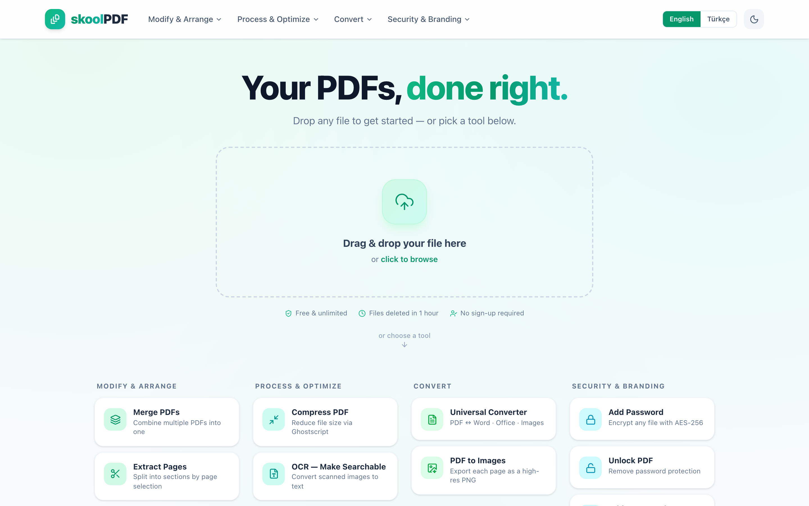
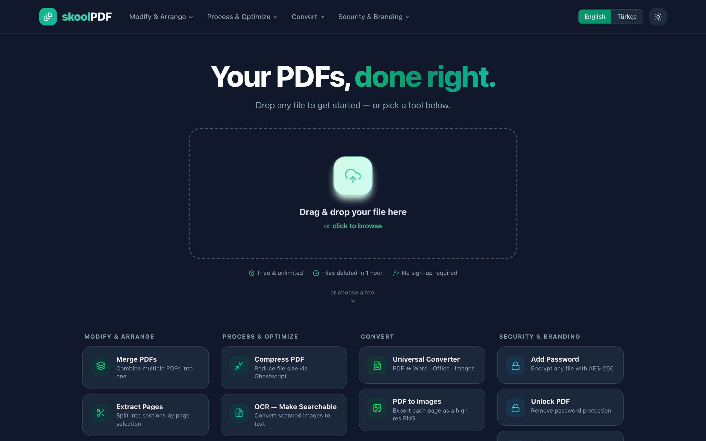
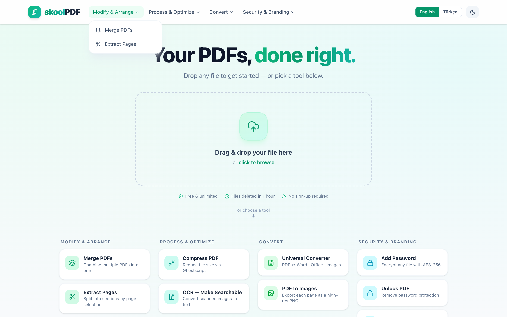
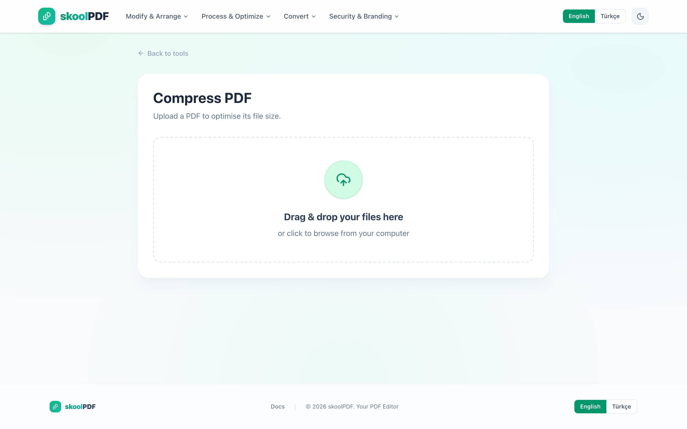
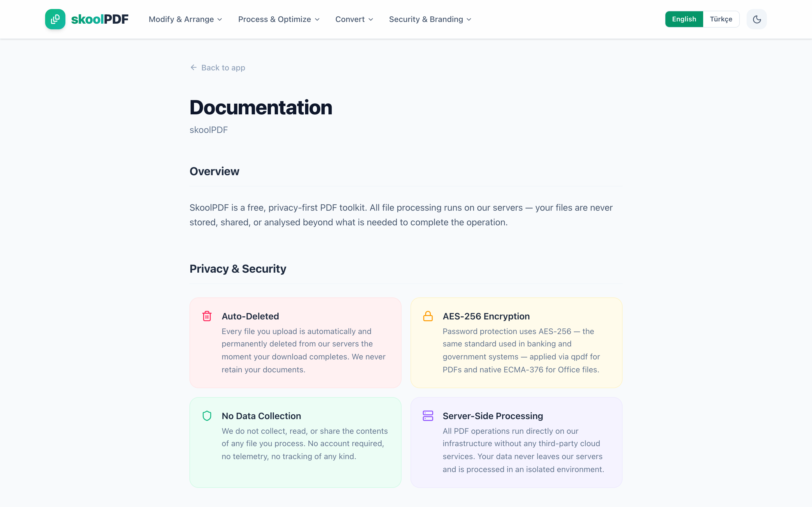
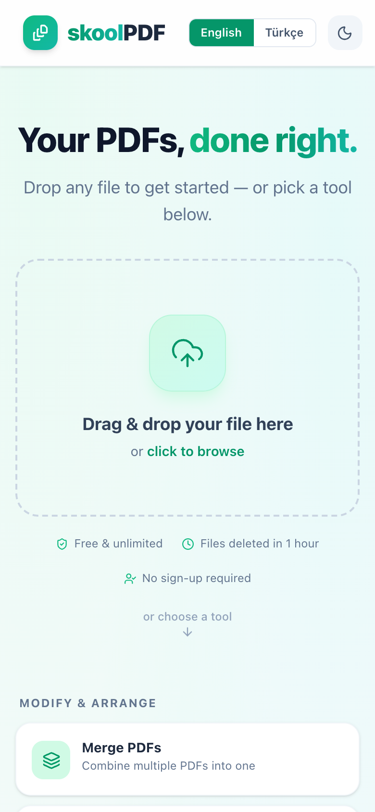

<div align="center">



<br/>

# skoolPDF

**Free, privacy-first PDF toolkit — no sign-up, no ads, no nonsense.**

[](https://www.skoolpdf.com)


</div>

---

## Overview

skoolPDF is a full-stack web application for processing PDF documents entirely on your own infrastructure. All operations run server-side using battle-tested open-source tools (Ghostscript, qpdf, ocrmypdf, LibreOffice). Files are permanently deleted the moment your download completes — no cloud storage, no third-party APIs.

---

## Screenshots

<table>
  <tr>
    <td align="center" width="50%">
      
      <sub><b>Dark Mode</b></sub>
    </td>
    <td align="center" width="50%">
      
      <sub><b>Light Mode</b></sub>
    </td>
  </tr>
  <tr>
    <td align="center" width="50%">
      
      <sub><b>Category Navigation Dropdown</b></sub>
    </td>
    <td align="center" width="50%">
      
      <sub><b>Tool Upload Flow</b></sub>
    </td>
  </tr>
  <tr>
    <td align="center" width="50%">
      
      <sub><b>Documentation Page</b></sub>
    </td>
    <td align="center" width="50%">
      
      <sub><b>Mobile Responsive</b></sub>
    </td>
  </tr>
</table>

---

## Features

### PDF Tools
| Tool | Description |
|------|-------------|
| **Merge PDFs** | Combine multiple PDFs with visual page reordering |
| **Extract Pages** | Pick individual pages via thumbnail gallery |
| **Compress PDF** | Ghostscript-powered compression (Screen / Ebook / Printer quality) |
| **OCR** | Make scanned PDFs searchable — auto-deskew, auto-rotate, text layer injection |
| **Universal Converter** | PDF ↔ Word, Excel, PowerPoint, Images (two-way) |
| **PDF to Images** | Export every page as high-res PNG (72 / 150 / 300 dpi) |
| **Add Password** | AES-256 encryption via qpdf |
| **Unlock PDF** | Remove password protection |
| **Add Watermark** | Stamp custom text on every page with font, size, opacity and angle controls |

### UX & Design
- **Dark / Light mode** — persisted via localStorage, respects system preference
- **English & Turkish** — full i18n coverage including tool names, labels, and hints
- **Drag & drop** everywhere — hero zone, tool upload zones, file reordering
- **Visual page selector** — canvas-rendered PDF thumbnails via pdfjs-dist
- **Category navigation** — header dropdown menus for quick tool access
- **WCAG AA** — accessible contrast ratios, ARIA labels, keyboard navigation

---

## Tech Stack

### Frontend
- **React 18** + Vite
- **Tailwind CSS v4** (CSS custom properties, `@theme` block)
- **Framer Motion** — animations
- **Lucide React** — icons
- **pdfjs-dist** — in-browser PDF rendering for page previews

### Backend
- **Node.js** + Express
- **Multer** — file handling
- **Ghostscript** — compression
- **qpdf** — AES-256 encryption / decryption
- **ocrmypdf** — OCR with deskew and auto-rotate
- **LibreOffice** — Office ↔ PDF conversion
- **pdf2docx** (Python) — PDF → Word
- **pdf-lib** — merge / split operations

---

## Getting Started

### Prerequisites
Make sure the following system tools are installed:

```bash
# macOS
brew install ghostscript qpdf ocrmypdf
brew install --cask libreoffice
pip install pdf2docx

# Ubuntu / Debian
apt-get install ghostscript qpdf ocrmypdf libreoffice
pip install pdf2docx
```

### Installation

```bash
git clone https://github.com/your-username/skool-pdf-app.git
cd skool-pdf-app

# Backend
cd backend && npm install
cp .env.example .env   # set PORT and any required vars

# Frontend
cd ../frontend && npm install
```

### Development

```bash
# Terminal 1 — Backend (port 5005)
cd backend && npm start

# Terminal 2 — Frontend (port 5173)
cd frontend && npm run dev
```

Open [http://localhost:5173](http://localhost:5173)

### Production Build

```bash
cd frontend && npm run build
# Serve the dist/ folder from your static host
```

---

## Project Structure

```
skool-pdf-app/
├── frontend/
│   └── src/
│       ├── components/
│       │   ├── ActionPanel.jsx      # Tool options & settings step
│       │   ├── Dashboard.jsx        # Home: hero drop zone + tool grid
│       │   ├── DocsPage.jsx         # Documentation page
│       │   ├── DropZone.jsx         # File upload step
│       │   ├── PageSelector.jsx     # Visual PDF page picker
│       │   └── TaskSelector.jsx     # 4-category tool grid
│       ├── context/
│       │   ├── TaskContext.jsx      # currentTask, files state
│       │   └── LanguageContext.jsx  # i18n provider
│       ├── i18n.js                  # All UI strings (en + tr)
│       └── index.css                # Tailwind v4 theme tokens
└── backend/
    ├── workers/                     # CLI tool wrappers
    │   ├── ghostscriptWorker.js
    │   ├── qpdfWorker.js
    │   ├── ocrWorker.js
    │   └── ...
    ├── routes/                      # Express route handlers
    └── index.js                     # Server entry point
```

---

## Privacy & Security

- **No accounts** — zero user data collected
- **Auto-deletion** — files are removed immediately after download
- **Server-side only** — no third-party cloud APIs touch your documents
- **AES-256** — encryption powered by qpdf, the same standard used in banking systems

---

## License

MIT — free to use, modify, and distribute.

---

<div align="center">
  <sub>Built with care · <a href="https://www.skoolpdf.com">www.skoolpdf.com</a></sub>
</div>
